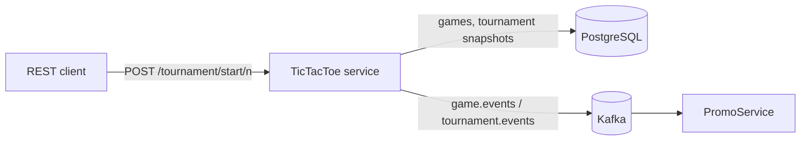

# TicTacToe Tournament Service


A Spring Boot service that runs tic-tac-toe tournaments between computer players, stores every result in PostgreSQL,
and publishes game and tournament events to Kafka for other services (such as
[PromoService](https://github.com/StefanBelc/PromoService)) to react to.

## How it works



- **Format by player count:** an odd number of players plays **round robin** (everyone plays everyone; a drawn pairing
  is replayed once); an even number plays **single elimination** (draws are replayed until someone wins; a bye is
  given when a round has an odd number of players).
- **Game engine:** players pick random free squares; the engine checks rows, columns and both diagonals after every move.
- **Events:** each game emits `CREATED`, `STARTED` and `FINISHED`; each tournament emits `CREATED`, `STARTED` and
  `FINISHED`. Events are sent with the tournament or game id as the Kafka key, so events for one id stay in order.
- **Recovery:** on startup, tournaments still marked `STARTED` in the database are replayed, so a crash mid-tournament
  does not leave it half-finished.

## REST API

| Method | Path | Returns |
| --- | --- | --- |
| POST | `/tournament/start/{numberOfPlayers}` | Podium (top three), tournament id, players, rounds. Minimum 3 players, otherwise **400** |
| GET | `/tournament/active` | Latest tournament: id, status, players, games played |

OpenAPI docs: `http://localhost:8080/swagger-ui.html`.

## Tech

Java 21 · Spring Boot 3.5 · Spring Data JPA / Hibernate · PostgreSQL · Spring Kafka · Bean Validation · springdoc-openapi ·
Lombok · Docker. Event contracts and Kafka producers come from the shared
[promobridge-sdk](https://github.com/StefanBelc/promobridge-sdk).

## Running it

Requirements: JDK 21 (`mvn -v` must show Java 21), Maven, Docker.

```bash
# 1. Install the shared SDK (not published to Maven Central)
git clone --branch 4.5 https://github.com/StefanBelc/promobridge-sdk.git
mvn -f promobridge-sdk/pom.xml install -DskipTests

# 2. Start Kafka and PostgreSQL (see https://github.com/StefanBelc/promo-infrastructure)

# 3. Run the service
export SPRING_DATASOURCE_URL=jdbc:postgresql://localhost:5432/promo_db
export SPRING_DATASOURCE_USERNAME=conduktor SPRING_DATASOURCE_PASSWORD=some_password
mvn spring-boot:run

# 4. Play a tournament
curl -X POST http://localhost:8080/tournament/start/5
```

## Tests

```bash
mvn verify   # needs Docker running for the integration tests
```

| Level | Class | What it proves |
| --- | --- | --- |
| Unit | `GameStateTest` | All 8 winning lines, draws, free squares, reset |
| Unit | `GameGridTest`, `PlayerTest`, `GameResultTest`, `DurationStopWatchTest` | Board updates, player moves and counters, result bookkeeping, timing |
| Unit | `GameEngineTest` | 200 random games: exactly one outcome, the winner really owns a line |
| Unit (Mockito) | `TournamentServiceTest` | Round robin vs single elimination, podium, persistence and event calls, recovery |
| Integration (Testcontainers) | `TournamentApiIntegrationTest` | Real HTTP call, PostgreSQL and Kafka: results are saved, invalid input returns 400, `FINISHED` event reaches Kafka |

CI runs the full suite on every push and pull request (GitHub Actions, JDK 21).

## Next steps

- Flyway migrations for the `games` and `tournaments` tables
- Make tournament state per-request instead of fields on a singleton service, so two tournaments can run at once
- Spring Boot Actuator health and metrics endpoints
